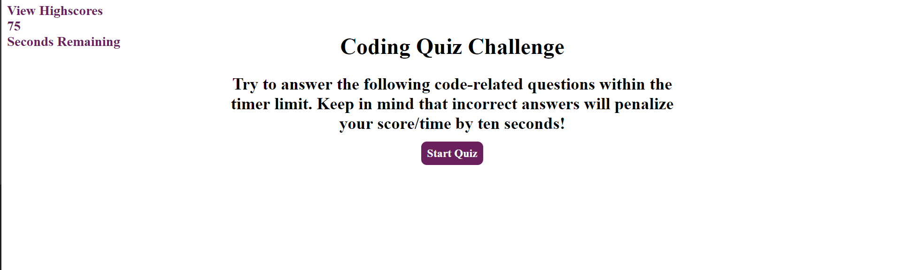
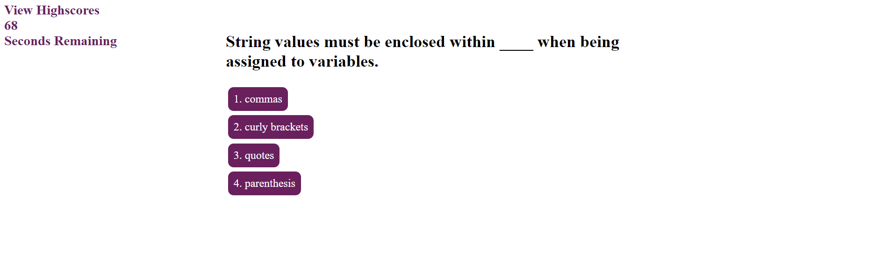
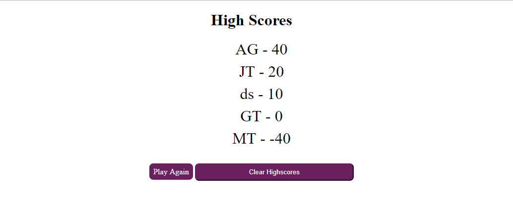
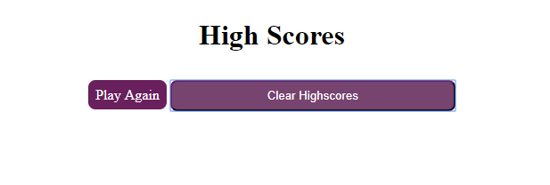

Javascript Code Quiz

This web application is a multiple-choice, interactive quiz that tests user's knowledge on the fundamentals of Javascript. When a user is led to the homepage they are shown alink to view the current highscores, the avaialble time to complete the quiz, and the option to start the quiz. Once the quiz is started, they will be presented wit 5 multiple choice questions. For every incorrect answer the score goes down 10 points and the time decreases by 10 seconds. For every correct answer the score increase 10 points. After the quiz is completed users are asked to store their initials and submit their score to the highscores list. Once submitted, the highscores page will open. Only the top 5 scores will be displayed. Users are then asked if they want to play again or if they want to clear the list. This will also clear the local storage list so highscores wil reset.

Quiz homepage

Quiz questions

High scores list

Cleared scores list

